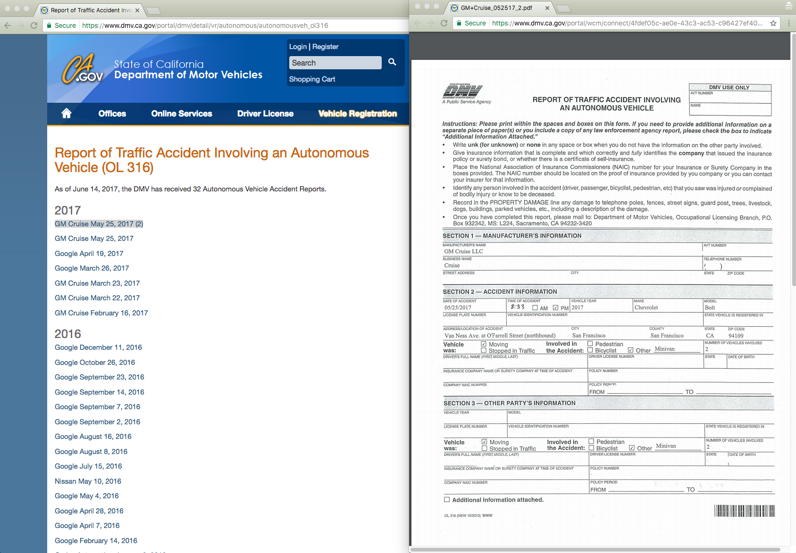

#  Mirror of CA.gov DMV's "Report of Traffic Accident Involving an Autonomous Vehicle (OL 316)"

This page is where California's DMV posts accident reports involving autonomous vehicles, [such as the ones operated by Google/Waymo](http://www.businessinsider.com/waymo-ends-publishing-self-driving-car-accident-reports-website-2017-1)

Mirror page:

https://wgetsnaps.github.io/ca-dmv-autonomous-vehicle-accidents/

Original page:

https://www.dmv.ca.gov/portal/dmv/detail/vr/autonomous/autonomousveh_ol316

The CA DMV page is mostly a bunch of links to PDFS:




## Scraping issues

**tl;dr**: The DMV page is a hot mess that can't be navigated by a Javascript-lacking client such as `wget`. So I've written a workaround that has one point-and-click step, and then a bunch of fancy `bash`-ing with regexes to at least mirror the content of the page (i.e. the PDF reports)


wget doesn't work because the CA DMV site won't work unless visited by a browser with JavaScript enabled, which is used to sloppily set a shit cookie. I say "sloppily" because it renders an error message even for the [Internet Archive's robust crawler](http://web.archive.org/web/20170425060918/https://www.dmv.ca.gov/portal/dmv/detail/vr/autonomous/autonomousveh_ol316), which likely means it's not particularly robust for web browsers with certain accessibility requirements.

So here's a manual workaround:

1. Visit the page using Chrome and have the **Network Panel** activated
2. Copy the request for the `autonomousveh_ol316` page using the **Copy as cURL** feature, which should result in a shell command that looks something like this:

    ```sh
    curl 'https://www.dmv.ca.gov/portal/dmv/detail/vr/autonomous/autonomousveh_ol316' \
      -H 'Pragma: no-cache' -H 'DNT: 1' \
      -H 'Accept-Encoding: gzip, deflate, sdch, br' \
      -H 'Accept-Language: en-US,en;q=0.8' -H 'Upgrade-Insecure-Requests: 1' \ -H 'User-Agent: Mozilla' \
      -H 'Accept: text/html,application/xhtml+xml,application/xml;q=0.9,image/webp,*/*;q=0.8' \ 
      -H 'Cache-Control: no-cache' \
      -H 'Cookie: pieceofshitcookie' -H 'Connection: keep-alive' --compressed
    ```
3. Curl that thing into a file named `original-index.html`
4. Make a directory called `pdfs`
4. Use a grep-like  (I prefer `ack`) to extract the URLs from this `original-index.html` page:

    ```sh
    $ ack 'href="(.+?pdf.+?)"' --output '$1' original-index.html
    ```

    Example output:

    ```
    /portal/wcm/connect/4fdef05c-ae0e-43c3-ac53-c96427ef40bd/GM+Cruise_052517_2.pdf?MOD=AJPERES
    /portal/wcm/connect/7775ab52-ff6a-4473-8300-e3d589cd6448/GMCruise_052517.pdf?MOD=AJPERES
    /portal/wcm/connect/40372935-f84b-402a-bd29-fd38924eccae/Google_041917.pdf?MOD=AJPERES
    ```

5. Feed that `ack` command into `curl` via a loop; note that the `MOD=AJPERES` has to be included in the GET request, as long as a nominal user agent (`'Mozilla' seems to work fine`)


    ```sh
    $ ack 'href="(.+?\.pdf)' original-index.html \
      --output '$1' \
      | while read -r href; do  
        url="https://www.dmv.ca.gov${href}?MOD=AJPERES"
        fname=$(basename $href)
        curl -A 'Mozilla' $url -o pdfs/$fname
    done
    ```

That sequence will download all the PDFs from the original site into the local subdirectory of `pdfs`, i.e. this URL:

https://www.dmv.ca.gov/portal/wcm/connect/a35d0b74-02dc-4725-9a5f-cc4ac71e421b/Google_110215.pdf?MOD=AJPERES


Will be saved as:

    /pdfs/Google_110215.pdf


Then use `sed` to create a `index.html` that's basically the same as `original-index.html`, except with the PDF URLs changed from their original values to the local ones, e.g. `/pdfs/whataver.pdf`


```sh

$ sed  -e 's/?MOD=AJPERES//' \
       -e 's#/portal/wcm/connect/[a-z0-9\-]*/#./pdfs/#' \
       -e 's/<base href/<meta data-href/' \
       original-index.html > index.html
```


You can visit the hacky, but *live* mirror here:

https://wgetsnaps.github.io/ca-dmv-autonomous-vehicle-accidents/

Or look at the raw [index.html](index.html) code.


