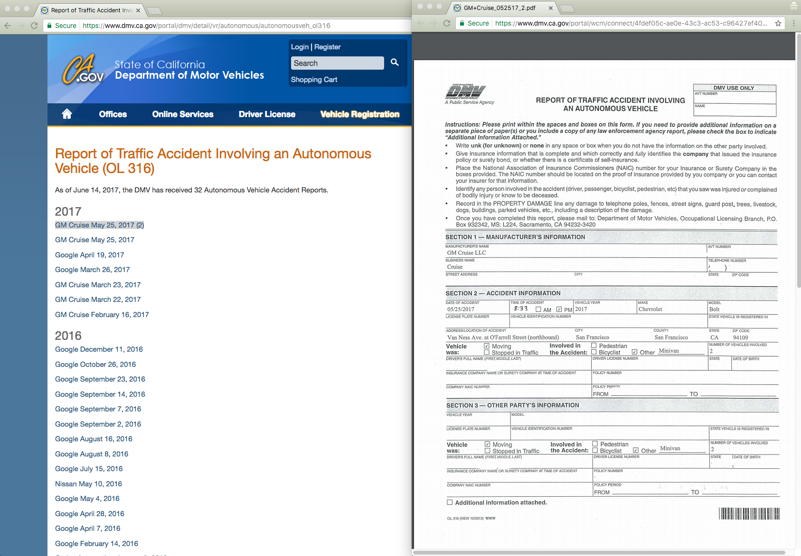
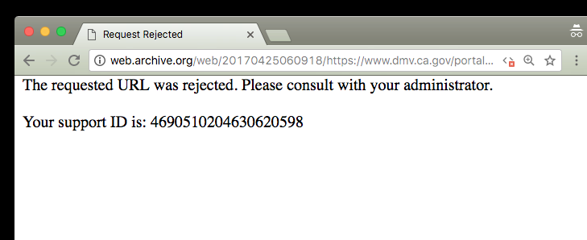
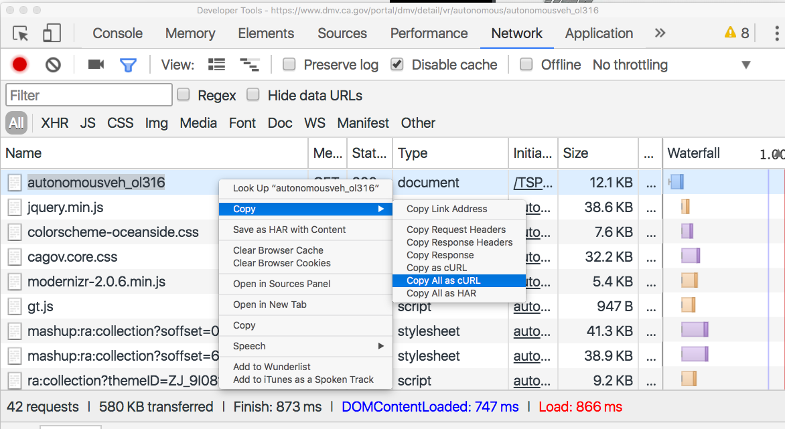
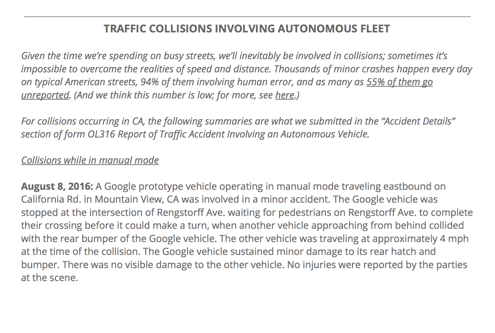
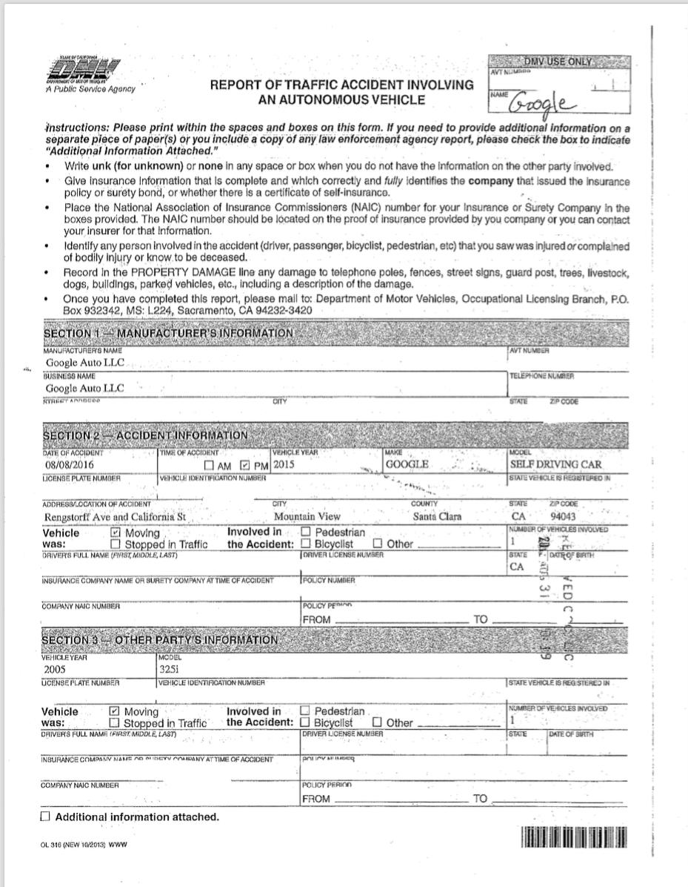
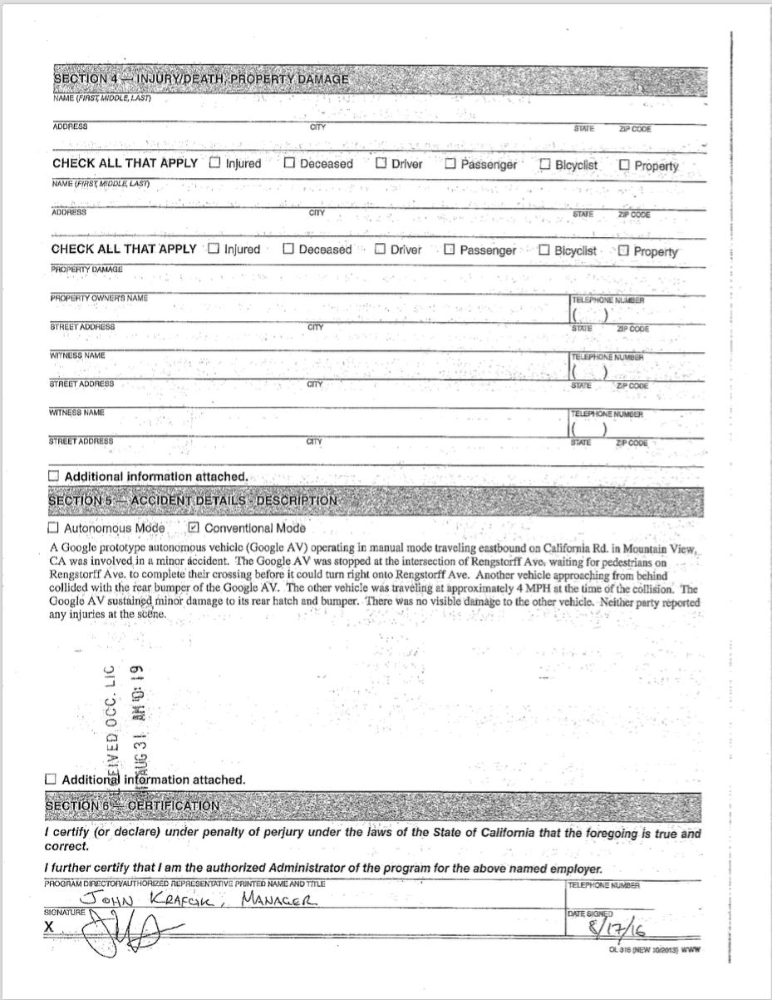

#  Mirror of CA.gov DMV's "Report of Traffic Accident Involving an Autonomous Vehicle (OL 316)"

### or, "How to semi-autonomously scrape the California DMV's autonomous vehicle accident reports"

### or, "*How to curl when wget gets blocked by JavaScript*"


Mirror page:

https://wgetsnaps.github.io/ca-dmv-autonomous-vehicle-accidents/

Original page:

https://www.dmv.ca.gov/portal/dmv/detail/vr/autonomous/autonomousveh_ol316


This page is where California's DMV posts accident reports involving autonomous vehicles, such as the ones operated by Google/Waymo. While [Google *used* to disclose these incidents voluntarily on its own site](http://2016.padjo.org/assignments/google-car-crash-reports/), the official forms/reports are published on dmv.ca.gov. 


As [Business Insider reports](http://www.businessinsider.com/waymo-ends-publishing-self-driving-car-accident-reports-website-2017-1):

> [Google/Waymo] removed the page of monthly reports detailing traffic collisions and other accidents on public roads that involve its self-driving vehicles. And Waymo will no longer publish the accident reports on its website, Business Insider has learned. 

> The page that once hosted all of the accident reports now redirects to Waymo's general website, which makes no mention of any accidents.


> ...Jessica Gonzalez, a spokesperson for the California DMV, told Business Insider that Waymo is not required to publish the monthly public reports. But the company is required to report any accident involving a Waymo self-driving vehicle to the DMV. Those accidents are published on the California DMV's website. 


FWIW, you can find a snapshot of what [https://www.google.com/selfdrivingcar/reports/](https://www.google.com/selfdrivingcar/reports/) looked like, as well as Google's version of the accident reports (still in PDF) on the Internet Archive:

http://web.archive.org/web/20161022094922/https://www.google.com/selfdrivingcar/reports/


## Web-scraping the manual way

**tl;dr**: California's DMV page is a **hot shit mess** that can't be used with a client that lacks Javascript, i.e. `wget` So I've written a workaround that has one point-and-click step, and then a bunch of fancy `bash`-ing with regexes to at least mirror the content of the page (i.e. the PDF reports)


So here's a manual workaround using `curl`, `sed`, `ack`, and a simple Bash loop. And Google Chrome's dev tools. 


### Saving a proper copy of the HTML


The CA DMV page is mostly a bunch of links to PDFS (which you can view in the [pdfs/](pdfs/) directory on this repo):




However, visiting the [CA DMV's Autonomous Reports accidents page](https://www.dmv.ca.gov/portal/dmv/detail/vr/autonomous/autonomousveh_ol316) in a non-JS enabled browser will get you something similar to what the [Internet Archive crawler gets](http://web.archive.org/web/20170425060918/https://www.dmv.ca.gov/portal/dmv/detail/vr/autonomous/autonomousveh_ol316) when encountering CA.gov's un-robust Javascript:



The dmv.ca.gov's Javascript, as far as I can tell, is used to set a cookie -- and check for headers, such as a `User-Agent` that is *not* `wget` -- that is validated server-side. Currently, `wget` doesn't execute Javascript, so that makes it fairly impossible to use `wget` alone to capture the dmv.ca.gov page.

So we require a *manual* step: visiting the CA.gov page using the Chrome web browser to get a `cURL` command that can be used to save the raw, rendered HTML.


1. Visit the page using Chrome and have the **Network Panel** activated
2. Copy the request for the `autonomousveh_ol316` page using the **Copy as cURL** feature:
  
   

3. This should result in a shell command that looks something like this:

    ```sh
    curl 'https://www.dmv.ca.gov/portal/dmv/detail/vr/autonomous/autonomousveh_ol316' \
      -H 'Pragma: no-cache' -H 'DNT: 1' \
      -H 'Accept-Encoding: gzip, deflate, sdch, br' \
      -H 'Accept-Language: en-US,en;q=0.8' -H 'Upgrade-Insecure-Requests: 1' \ -H 'User-Agent: Mozilla' \
      -H 'Accept: text/html,application/xhtml+xml,application/xml;q=0.9,image/webp,*/*;q=0.8' \ 
      -H 'Cache-Control: no-cache' \
      -H 'Cookie: pieceofshitcookie' -H 'Connection: keep-alive' --compressed
    ```
4. Paste that `curl` into your Terminal and save the results as a file named [`original-index.html`](original-index.html)


### Extracting the PDFs

[original-index.html](original-index.html) contains the HTML as found on the real live site, which means that the URLs for the PDFs are relative and in this kind of format:

```html
<p dir="ltr">
  <a href="/portal/wcm/connect/7775ab52-ff6a-4473-8300-e3d589cd6448/GMCruise_052517.pdf?MOD=AJPERES" >
    GM Cruise May 25, 2017
  </a>
</p>
```

So we need to extract those relative URLs, translate them to absolute URLs, and download them to our computer. This can be done with a combination of regexes and a Bash `while` loop, with `curl`:


1. Make a directory called `pdfs`, e.g. `$ mkdir pdfs`
2. Use a grep-like program to match and extract the URLs from the `[original-index.html](original-index.html)` file. I like using [ack](https://beyondgrep.com/) because it not only provides PCRE-flavor regexes, but the use of capture groups to format output just as we need it (you could consider it a lazy person's `awk`):

    ```sh
    ack 'href="(.+?\.pdf)' original-index.html \
      --output '$1'
    ```

    Example output:

    ```
      /portal/wcm/connect/4fdef05c-ae0e-43c3-ac53-c96427ef40bd/GM+Cruise_052517_2.pdf
      /portal/wcm/connect/7775ab52-ff6a-4473-8300-e3d589cd6448/GMCruise_052517.pdf
      /portal/wcm/connect/40372935-f84b-402a-bd29-fd38924eccae/Google_041917.pdf
      /portal/wcm/connect/9ff287ca-2562-48f2-999d-be18e1714eba/Google_032617.pdf
      /portal/wcm/connect/c7b00b79-1bc3-46d5-bd96-606342046aa8/GMCruise_032317.pdf
      /portal/wcm/connect/562b91e1-e05f-4ba3-8d62-6794d0f6509e/GMCruise_032217.pdf
      /portal/wcm/connect/a549dbc4-a164-4813-bc72-3164261fc89a/GMCruise_021617.pdf
      /portal/wcm/connect/3d358211-3f0c-430e-b8db-b13392239e1e/Google_121116.pdf
      /portal/wcm/connect/4a39c1b9-ca1f-4184-8b78-96d6baf98628/Google_102616.pdf
    ```

3. Feed that `ack` command into `curl` via a loop; note that the `MOD=AJPERES` has to be included in the GET request, as well as a nominal user agent (`'Mozilla'` seems to work fine):


    ```sh
    $ ack 'href="(.+?\.pdf)' original-index.html \
      --output '$1' \
      | while read -r href; do  
        url="https://www.dmv.ca.gov${href}?MOD=AJPERES"
        fname=$(basename $href)
        curl -A 'Mozilla' $url -o pdfs/$fname
    done
    ```

That sequence will download all the PDFs from the original site into the local subdirectory of `pdfs`, i.e. this URL:

https://www.dmv.ca.gov/portal/wcm/connect/a35d0b74-02dc-4725-9a5f-cc4ac71e421b/Google_110215.pdf?MOD=AJPERES


Will be saved as:

[/pdfs/Google_110215.pdf](pdfs/Google_110215.pdf)


### Creating `index.html` with relative links

Now the [pdfs/](pdfs/) directory contains all of the PDFs in one place, locally, for easy browsing. This next step is optional; it simply creates a version of [original-index.html](original-index.html) in which the PDF links have been translated to point to `/pdfs` instead of `https://www.dmv.ca.gov/portal/wcm/connect/`.

The result is [index.html](index.html), which can be visited as hosted on Github Pages at:

https://wgetsnaps.github.io/ca-dmv-autonomous-vehicle-accidents/


```sh

$ sed  -e 's/?MOD=AJPERES//' \
       -e 's#/portal/wcm/connect/[a-z0-9\-]*/#./pdfs/#' \
       -e 's/<base href/<meta data-href/' \
       original-index.html > index.html
```

Short explanation of this `sed` command: it runs 3 substitution expressions:

1. Remove all instances of `?MOD=AJPERES`
2. Replace the `/portal/wcm/connect/...` paths with `./pdfs/`
3. Neuter the `<base>` tag which caused the browser to prepend the original `dmv.ca.gov` domain to relative URLs.


### Archiving Google's monthly accident reports

tl;dr: Using `curl`, `ack`, and `xargs` to do a quickie archive of Google's self-published reports and saving them to [google-pdfs/](google-pdfs/) 

*note: This really should be its own [wgetsnaps](https://github.com/wgetsnaps) repo, but whatever.*


As mentioned in the intro, Google used to publish their own monthly compilations of the accident reports. This was in addition to what they submitted to California's DMV, but these reports were more reader-friendly and contained more information about Google's overall program, including accidents that happened outside of California.

Google's landing page for these reports *was* at: https://www.google.com/selfdrivingcar/reports/

However, as Business Insider reported, the landing page was changed to a redirect to Waymo [in January 2017](http://web.archive.org/web/20170225184124/https://www.google.com/selfdrivingcar/reports/).

The most recent snapshot of Google's reports page, pre-Waymo-redirect, is from [The Internet Archive on October 22, 2016](http://web.archive.org/web/20161022094922/https://www.google.com/selfdrivingcar/reports/)

The snapshot links to the Google PDFs, but the Archive may not have actually saved a copy of those PDFs, because their URLS do a redirect, e.g. 

From: 

https://www.google.com/selfdrivingcar/files/reports/report-0916.pdf

To:

https://static.googleusercontent.com/media/www.google.com/en//selfdrivingcar/files/reports/report-0916.pdf

At some point, this Google static file server might be taken down, so let's archive the reports using the URLs as found on the Archive snapshot and using `curl` to follow the redirects:


```sh
$ mkdir -p google-pdfs && cd google-pdfs
$ curl \
    http://web.archive.org/web/20161022094922/https://www.google.com/selfdrivingcar/reports/ \
  | ack -o 'https://www.google.com/selfdrivingcar/files.+\.pdf(?=")' \
  | xargs -n 1 curl -LO
```

Notes:

- the `L` flag for `curl` is used to follow the redirect
- `xargs -n 1` specifies that the `curl -LO` command only uses 1 argument, i.e. `curl` is run for each URL extracted via the `ack` capture.


#### Getting the post-September-2016 reports

Because the Internet Archive only managed to get a snapshot of the page in late [October 2016](http://web.archive.org/web/20161022094922/https://www.google.com/selfdrivingcar/reports/), the archive HTML doesn't contain links to the October, November, or December reports for 2016, if such reports existed.

Luckily, it's pretty easy to guess Google's naming convention from the existing files:

`.../selfdrivingcar/files/reports/report-0916.pdf`

i.e., the October and November 2016 reports are likely, and respectively, at:

https://static.googleusercontent.com/media/www.google.com/en//selfdrivingcar/files/reports/report-1016.pdf

https://static.googleusercontent.com/media/www.google.com/en//selfdrivingcar/files/reports/report-1116.pdf

(If Google published a December 2016 or annual 2016 report, it doesn't exist at the expected URLs.)


One more `curl`, using its [nifty URL globbing feature](https://ec.haxx.se/cmdline-globbing.html):

```sh
# assuming we're still in google-pdfs/
$ curl -LO \
  https://static.googleusercontent.com/media\
/www.google.com/en//selfdrivingcar/files/reports\
/report-[10-11]16.pdf
```


The results are saved in this repo in the [google-pdfs/](google-pdfs/) subdirectory.

Compare Google's self-published August 2016 report versus the 2 accident reports it submitted to the CA DMV:

- Google's self-published report for August 2016: [google-pdfs/report-0816.pdf](google-pdfs/report-0816.pdf)
- Google's reports as submitted to the DMV:
  - [pdfs/Google_080816.pdf](pdfs/Google_080816.pdf)
  - [pdfs/Google_081616.pdf](pdfs/Google_081616.pdf)


Here's a screenshot of the August 8, 2016 accident as described in Google's [self-published monthly report](google-pdfs/report-0816.pdf):



Here's screenshots of [the August 8, 2016 report](pdfs/Google_080816.pdf), as sent to the DMV. Note how the narrative is worded slightly differently, and how the form has fields for specific details, such as **Time of Accident**, that aren't seen as relevant in Google's monthly summaries:






## Conclusion

Government websites should use Javascript *sparingly*. There's no reason why a page that simply lists links to static content (PDFs) needs to be completely dependent on Javascript (and incredibly brittle Javascript at that) to render public information.

Otherwise, feel free to use these reports for your research. I use them as an [exercise on the process -- and its complications and nuances -- of turning event info into structured data](http://2016.padjo.org/assignments/google-car-crash-reports/). 


